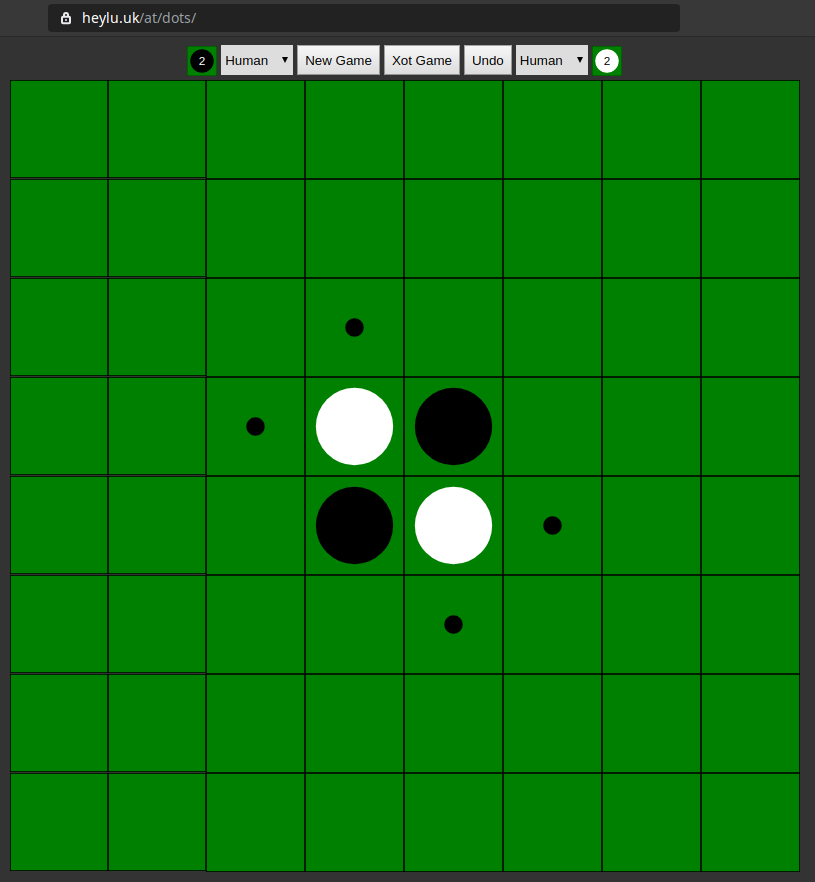

# Dots
Othello game with AI

[Live demo](https://heylu.uk/at/dots/)

## Features
* Nice frontend
* Strong AI
* [Xot openings](http://berg.earthlingz.de/xot/aboutxot.php?lang=en)
* Best move analysis
* Undo option

### Requirements:
* Docker
* Docker-compose

### How to use:
* Run `docker-compose up`
* Go to [localhost:8080](http://localhost:8080) in your browser

### How to run tests:
* Run `./test.sh`

### Upcoming features:
* See [TODO](TODO.md) file